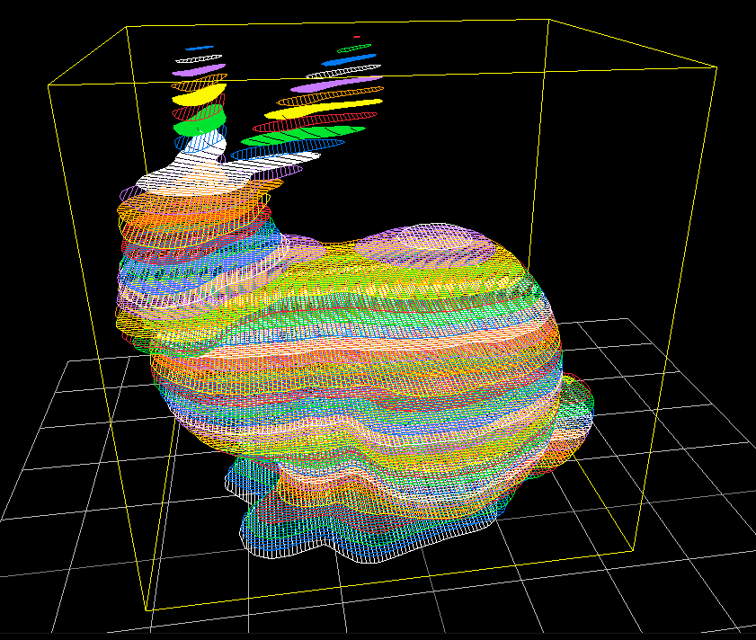
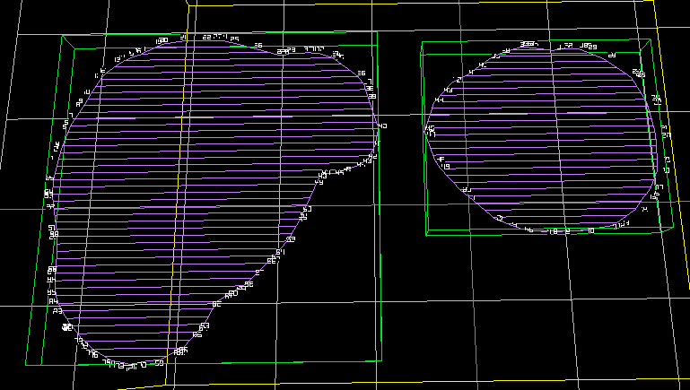
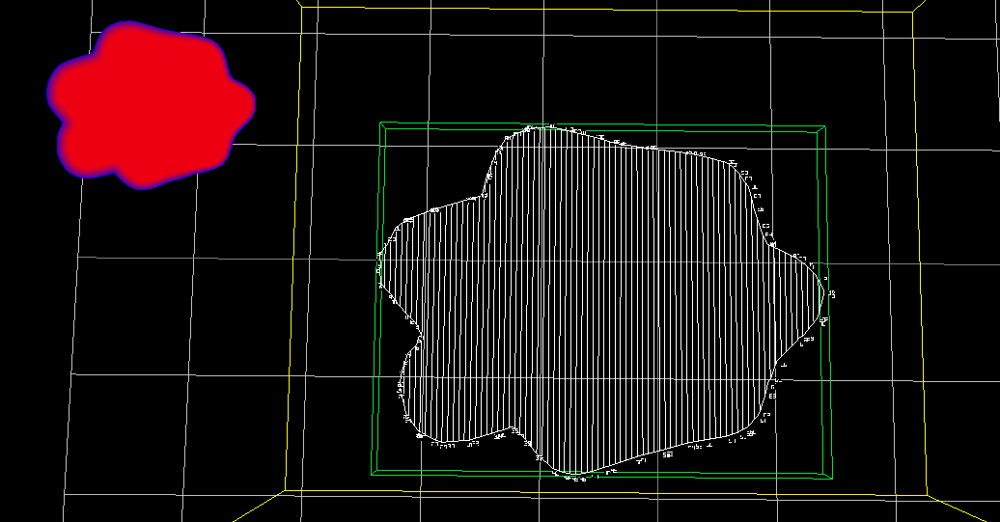

# Slices Models into lines and calculate stresses during printing process

## Example
Stanford bunny:
- layer height: 0.1
- model scale: 30.0
- line width: 0.04
- infill pattern: Rectilinear
- infill %: 100%

Single layer view, with seperated contours (layer 27).

Simulated peak temperatures during printing (layer 0).

